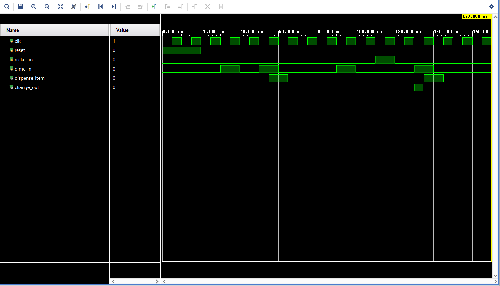

# Vending Machine Controller using Verilog HDL

A digital vending machine controller designed using **Verilog HDL** and implemented using a **Finite State Machine (FSM)**. The controller accepts 5-cent and 10-cent coin inputs, dispenses a product when the required amount is reached, and provides 5-cent change when the customer overpays.

## Project Overview

This project was developed as a mini project as part of a **Digital Electronics and VLSI internship**.

The project demonstrates the design, modeling, and simulation of a digital vending machine controller using **Verilog Hardware Description Language (HDL)** and a **Finite State Machine (FSM)**.

The design was simulated and functionally verified using **AMD/Xilinx Vivado Simulator**.

## Objectives

- Understand the fundamentals of digital systems and VLSI.
- Model digital circuits using Verilog HDL.
- Implement a practical digital system using a Finite State Machine.
- Design and verify a vending machine controller.
- Develop a Verilog testbench for functional verification.
- Analyze the simulation waveform generated using Vivado.

## Features

- Verilog HDL based design
- Finite State Machine (FSM) implementation
- Accepts 5-cent and 10-cent coins
- Product price: **20 cents**
- Automatic product dispensing
- 5-cent change for 25-cent payment
- Synchronous state transitions
- Dedicated Verilog testbench
- Functional verification using Vivado simulation

## Finite State Machine

| State | Description |
|---|---|
| `IDLE` | Waiting for a coin |
| `S5` | 5 cents inserted |
| `S10` | 10 cents inserted |
| `S15` | 15 cents inserted |
| `DISPENSE` | Product is dispensed |

### FSM Flow

```text
                +---------+
                |  IDLE   |
                +----+----+
                     |
              5¢     |     10¢
              |      |
              v      v
            +----+  +-----+
            | S5 |  | S10 |
            +--+-+  +--+--+
               |       |
             5¢/10¢   5¢/10¢
               |       |
               +---+---+
                   |
                  S15
                   |
             5¢ / 10¢
                   |
                   v
              +---------+
              | DISPENSE|
              +---------+
                   |
                   v
                 IDLE
```

## Vending Machine Operation

The product price is **20 cents**.

### Case 1 — Exact Payment

```text
10¢ → 10¢
```

Total: **20¢**

The machine reaches the `DISPENSE` state and activates:

```text
dispense_item = 1
```

### Case 2 — Overpayment

```text
10¢ → 5¢ → 10¢
```

Total: **25¢**

The machine dispenses the product and activates:

```text
change_out = 1
```

indicating that **5 cents of change** should be returned.

## Inputs

| Signal | Description |
|---|---|
| `clk` | System clock |
| `reset` | Resets the FSM to the `IDLE` state |
| `nickel_in` | 5-cent coin input |
| `dime_in` | 10-cent coin input |

## Outputs

| Signal | Description |
|---|---|
| `dispense_item` | Indicates that the product should be dispensed |
| `change_out` | Indicates that 5-cent change should be returned |

## Design Architecture

The Verilog design consists of two main parts.

### 1. Sequential Logic

The sequential logic stores the current FSM state.

```verilog
always @(posedge clk, posedge reset)
```

The state is updated on the clock edge, while the reset returns the machine to the `IDLE` state.

### 2. Combinational Logic

The combinational block determines:

- The next FSM state
- Product dispensing
- Change generation

```verilog
always @(*)
```

The `case` statement implements the FSM transition logic.

## Simulation & Verification

The design was verified using a dedicated Verilog testbench in **Vivado Simulator**.

### Test Cases

| Test Case | Input Sequence | Expected Behavior |
|---|---|---|
| Reset | `reset = 1` | FSM returns to `IDLE` |
| Exact payment | `10¢ + 10¢` | Product dispensed |
| Overpayment | `10¢ + 5¢ + 10¢` | Product dispensed + 5¢ change |

### Simulation Result

The waveform below shows the clock, reset, coin inputs, product dispensing signal, and change output during simulation.



## Tools & Technologies

- **Hardware Description Language:** Verilog HDL
- **Simulation Tool:** AMD/Xilinx Vivado
- **Simulator:** Vivado Simulator
- **Design Method:** Finite State Machine (FSM)
- **Verification:** Verilog Testbench

## Project Structure

```text
vending-machine-verilog-fsm/
│
├── src/
│   └── vending_machine.v
│
├── simulation/
│   └── vending_machine_tb.v
│
├── images/
│   └── simulation_waveform.png
│
├── docs/
│
├── project_1.xpr
├── .gitignore
└── README.md
```

## Future Scope

The current design can be extended to support:

- Multiple products with different prices
- Product-selection input
- LCD or 7-segment display
- Balance and transaction information display
- Cancel and refund operations
- Secure maintenance/admin interface
- Hardware implementation on an FPGA platform

## Project Context

This project was developed as part of a **Digital Electronics and VLSI** internship and demonstrates the practical application of:

- Digital logic
- Finite State Machines
- Hardware Description Languages
- Sequential and combinational logic
- Digital circuit simulation
- Functional verification

## Author

**R. Abhiram Naidu**

B.Tech – Electronics and Communication Engineering  
Andhra University

## Documentation

The complete project presentation/report can be added to the `docs/` directory.
